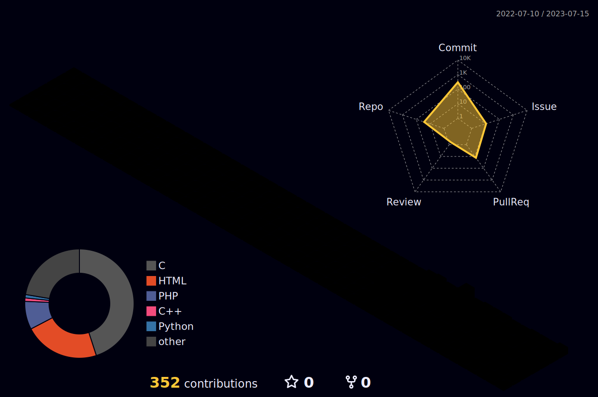
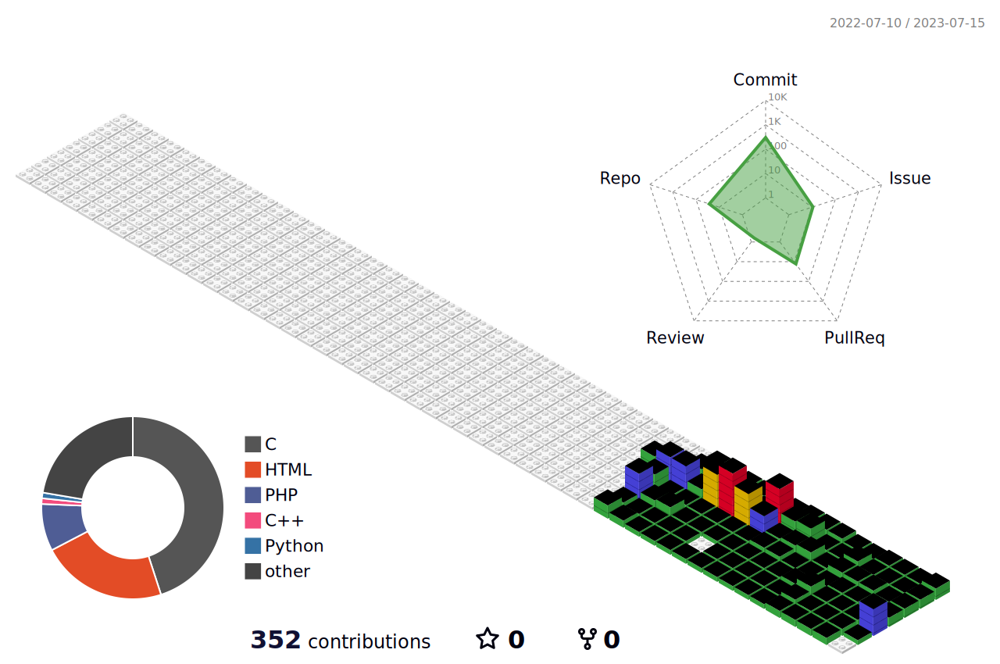

<h1 align="center">🛠 Tech Stack 🛠</h1>

  
  
  
  
  
  
  
  
  
  

<h1 align="center">⭐ Me ⭐</h1>

 

  

  
  <h1 align="center"> 🏆 Awards 🏆</h1>
    
<strong>2021 삼성 주니어 SW 창작 대회 Finalist</strong>

    
<strong>2022 삼성 주니어 SW 창작 대회 Finalist</strong>

#

